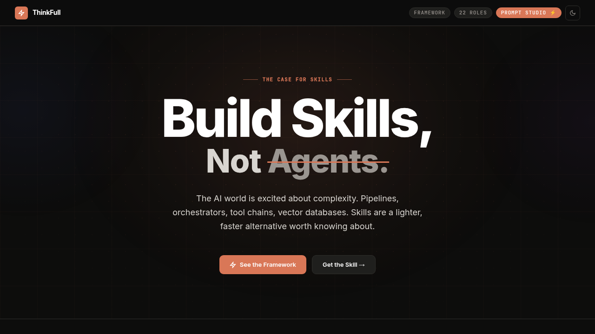
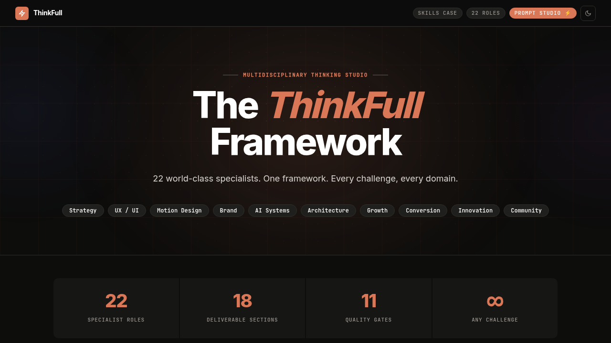
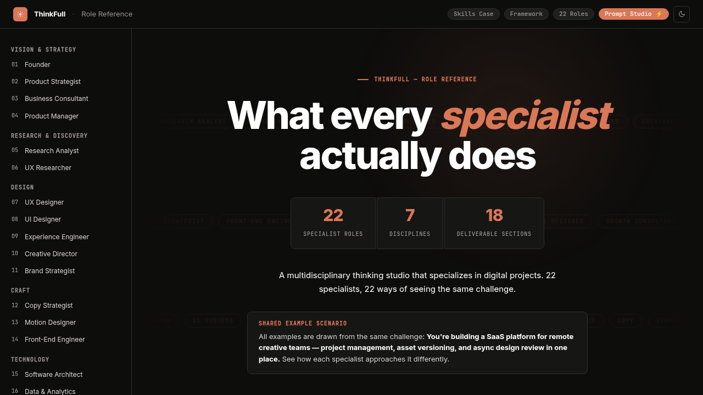
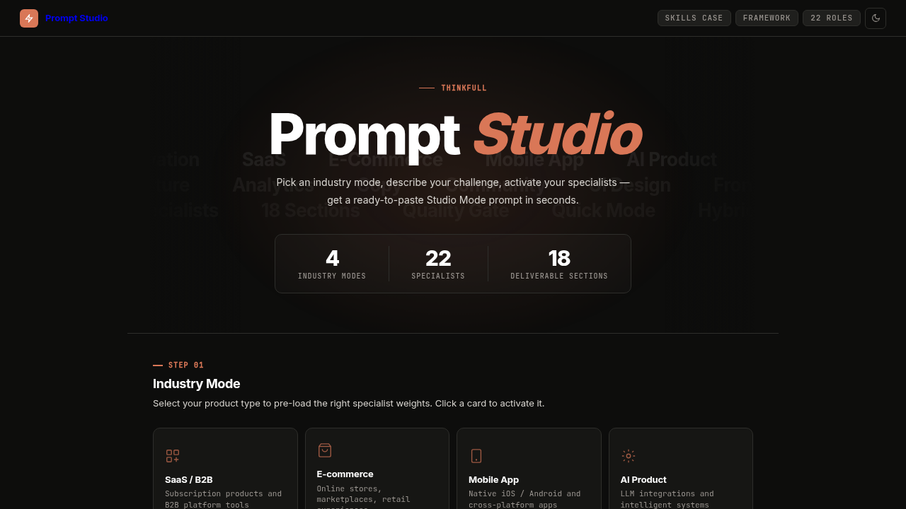

# ThinkFull

**A multidisciplinary thinking studio for Claude Code.**  
22 world-class specialists. One skill file. Every challenge, every domain.

---

<table>
<tr>
<td width="50%"><a href="https://supernotesonline.github.io/ThinkFull/build-skills.html"></a></td>
<td width="50%"><a href="https://supernotesonline.github.io/ThinkFull/thinkfull.html"></a></td>
</tr>
<tr>
<td width="50%"><a href="https://supernotesonline.github.io/ThinkFull/agent-roles.html"></a></td>
<td width="50%"><a href="https://supernotesonline.github.io/ThinkFull/studio-launchpad.html"></a></td>
</tr>
</table>

---

### Live Site

[supernotesonline.github.io/ThinkFull](https://supernotesonline.github.io/ThinkFull/)

---

### What It Is

ThinkFull is a Claude Code skill that activates a full team of specialists the moment you describe a challenge. Product strategy, UX, copywriting, engineering, growth, brand, AI systems — all 22 disciplines fire simultaneously, not one at a time.

No agents. No pipelines. No orchestration overhead. Just a skill file you drop into your Claude setup.

---

### Install

**1. Clone the skill into your Claude skills folder:**

```bash
git clone https://github.com/SuperNotesOnline/ThinkFull.git ~/.claude/skills/thinkfull
```

**2. Restart Claude Code.**

**3. Activate with:**

```
/thinkfull
```

That's it. Throw any digital project challenge at Claude and all 22 specialists engage behind the scenes.

---

### What You Get

| Specialists | Coverage |
|---|---|
| Founder · Product Strategist · Business Consultant | Strategy & vision |
| UX Researcher · UX Designer · UI Designer | Experience & interface |
| Creative Director · Brand Strategist · Copy Strategist | Brand & messaging |
| Motion Designer · Experience Engineer · Front-End Engineer | Build & interaction |
| Software Architect · AI Systems Designer · Data & Analytics | Tech & intelligence |
| Growth Consultant · Conversion Architect · Community Designer | Growth & ecosystem |
| Innovation Director · Product Manager · QA Lead | Quality & future |

---

### Learn More

- [The Case for Skills](https://supernotesonline.github.io/ThinkFull/build-skills.html) — why skills beat agents for most challenges
- [The Framework](https://supernotesonline.github.io/ThinkFull/thinkfull.html) — how ThinkFull works
- [22 Specialist Roles](https://supernotesonline.github.io/ThinkFull/agent-roles.html) — the full team
- [Prompt Studio](https://supernotesonline.github.io/ThinkFull/studio-launchpad.html) — build a custom prompt

---

*Personal use only. Not for redistribution or modification.*
